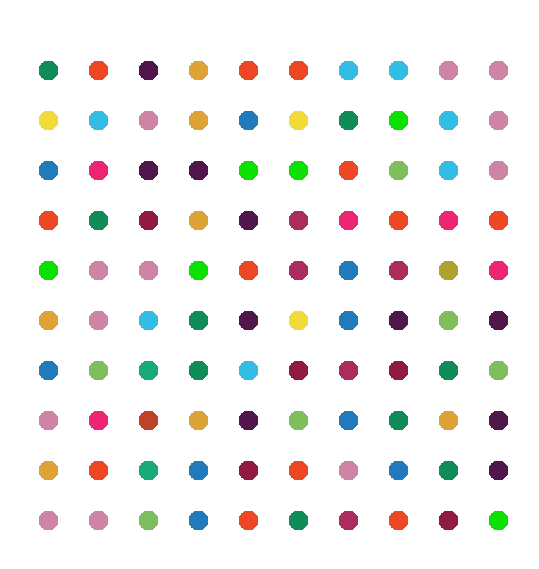

this project recreates a digital version of Damien Hirst's famous spot paintings using Python's turtle library. Inspired by the artist's signature style, the program generates a grid of colorful dots using RGB values randomly selected from a color palette extracted from an image. This project was created as part of the "100 Days of Code Python Pro Bootcamp" Udemy course and serves as an exercise in working with loops, functions, turtle graphics, and color manipulation.

